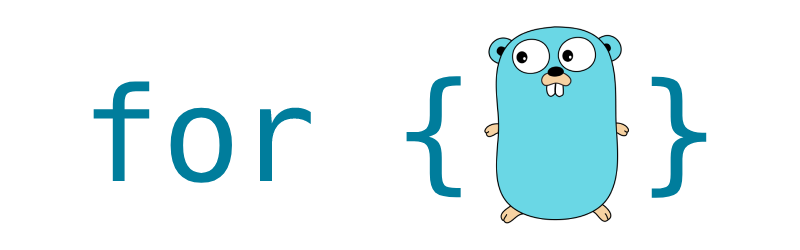

<p align="center">
  
</p>

 <h1 align="center">forgolang</h1>

 <p align="center">
   <a href="https://circleci.com/gh/streetbyters/forgolang_forum">
    
   </a>
   <a href="https://github.com/streetbyters/forgolang_forum/blob/master/LICENSE">
    
   </a>
   <a href="https://codecov.io/gh/streetbyters/forgolang_forum">
     
   </a>
   <a href="https://goreportcard.com/report/github.com/streetbyters/forgolang_forum">
    
   </a>
 </p>

Forgolang.com's open-source discussion forum system.\
But you can also use it as a small framework. :)

## Roadmap
 - [x] Core system
 - [x] Authorization system integration
 - [ ] All modules integrations (category, posts, chat)
 - [ ] Notification system integration
 - [ ] CI/CD Tools integration

That's all for now. :)

## Requirements
 - Go > 1.11.x
 - PostgreSQL
 - Redis 
 - RabbitMQ
 - Elasticsearch 7.x

## Development
```shell script
git clone -b develop https://github.com/streetbyters/forgolang_forum

go mod vendor

go run ./cmd -genSecretEnv

# Development Mode
go run ./cmd -mode dev -migrate -reset
go run ./cmd -mode dev

# Test Mode
go run ./cmd -mode test -migrate -reset
go run ./cmd -mode test
```

## Tasks
If you have added a new API endpoint.
```shell script
go run ./cmd -mode dev -task -name GenerateRolePermissions
```
#### Add Task
Create task file on ***tasks*** directory. On the bottom you can also see the sample task function.
```go
package tasks

import "forgolang_forum/cmn"

// ExampleTask for forgolang_forum
func ExampleTask(app *cmn.App, args ...interface{}) {
    app.Logger.LogInfo("Example Task")
}
```

After creating the task file, define the task to the task section in the ***cmd/main.go*** file.
```go
package main

func main() {
    ...
    // Tasks
    _ts["ExampleTask"] = tasks.ExampleTask
    // Tasks
    ...
}
```
Finally, call the task from the command line.
```shell script
go run ./cmd -mode dev -task -name ExampleTask
```

## Integrations
 - [Github](docs/integrations.md)
 - AWS(SES, S3)

## Contribution
I would like to accept any contributions to make Forgolang.com better and feature rich.\
[See detail](docs/contributions.md)

## LICENSE

Copyright 2019 Street Byters Community

Licensed under the Apache License, Version 2.0 (the "License");
you may not use this file except in compliance with the License.
You may obtain a copy of the License at

   http://www.apache.org/licenses/LICENSE-2.0

Unless required by applicable law or agreed to in writing, software
distributed under the License is distributed on an "AS IS" BASIS,
WITHOUT WARRANTIES OR CONDITIONS OF ANY KIND, either express or implied.
See the License for the specific language governing permissions and
limitations under the License.
